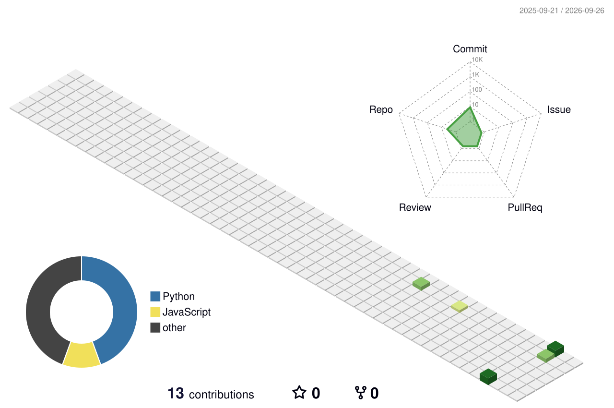
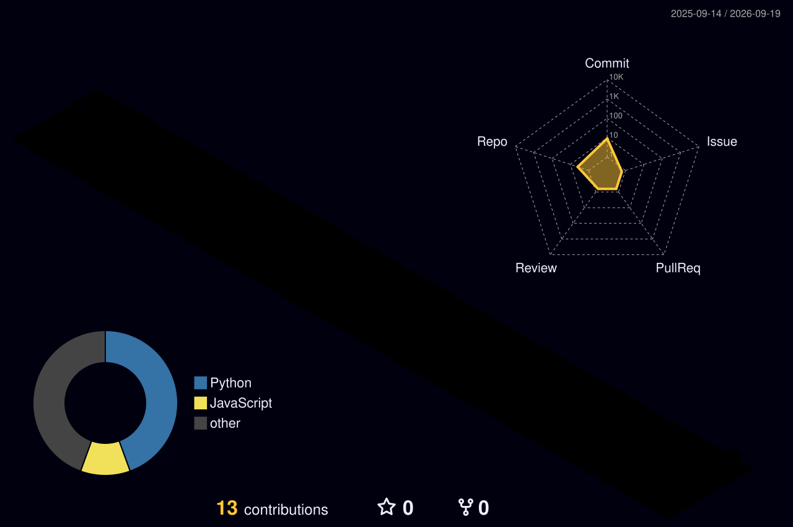

<h1 align="center">Hi 👋, I'm Amir Foysal</h1>
<h3 align="center">• Programmer • Full Stack Web Developer • Security Enthusiast • AI (Progressing)</h3>

- 🔭 I'm currently working on **MERN stack projects**
- 🌱 I'm currently learning **AI & Cyber Security**
- 📍 I live in **Dhaka, Bangladesh**
- 📫 Reach me at: [LinkedIn](https://www.linkedin.com/in/amirxfoysal)

<h3 align="left">Connect with me:</h3>

  
  
  
  

<h3 align="left">Languages and Tools:</h3>

  
  
  
  
  
  
  
  

## 🌍 Dynamic 3D Contribution Graph

<picture>
  <source media="(prefers-color-scheme: dark)" srcset="./profile-3d-contrib/profile-night-animate.svg" />
  <source media="(prefers-color-scheme: light)" srcset="./profile-3d-contrib/profile-green-animate.svg" />
  
</picture>

### 🌈 Seasonal variants

| Day 🌞 | Night 🌙 | Rainbow ✨ |
| --- | --- | --- |
|  |  |  |

---

⭐️ From [amirxfoysal](https://github.com/amirxfoysal)
